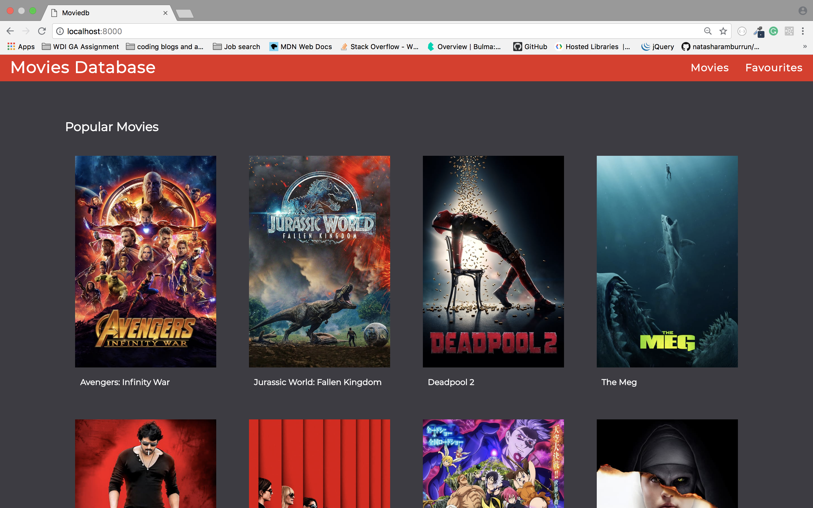
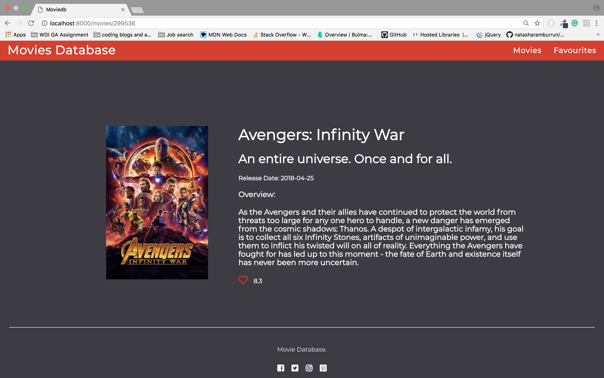
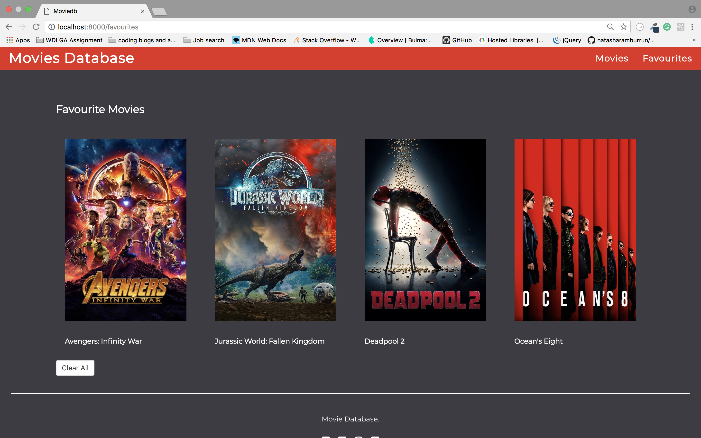

## Movies Database

### Key requirements:
- Use an API to display a list of items on a page (used any API  through demonstration with GraphQL will be a bonus)
- Click on an item and go to basic item show page to display more information
- Add a favourite icon which adds the item to a list in your 'account' (no account created required)

#### Technologies Used:
HTML | SCSS | JavaScript (ES6) | React | Webpack | Bulma | Sass

#### Build:

I decided to build this website using TMDb The movies database API to retrieve items. This API documentation was straightforward and easy to follow.

I used LocalStorage to get, set and remove favourite items appending them into an array this meant I did not need a backend server to complete this exercise.

#### Wins:

My ability to complete this task without the support of the academy teachers I found Google very helpful and used tutorials to get the favourite route working.

#### Challenges:

Found using localStorage challenging at first but managed to work my way through this by using pseudocode to understand the steps reach a solution.

#### Print Screens:

<strong>Index Page</strong>:

<strong>Show Page</strong>:

<strong>Favourite Page</strong>:

